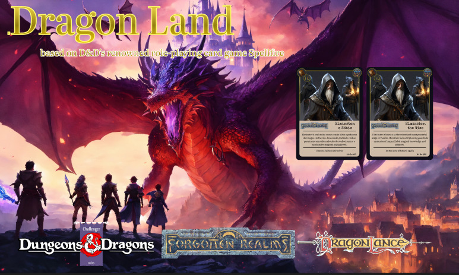
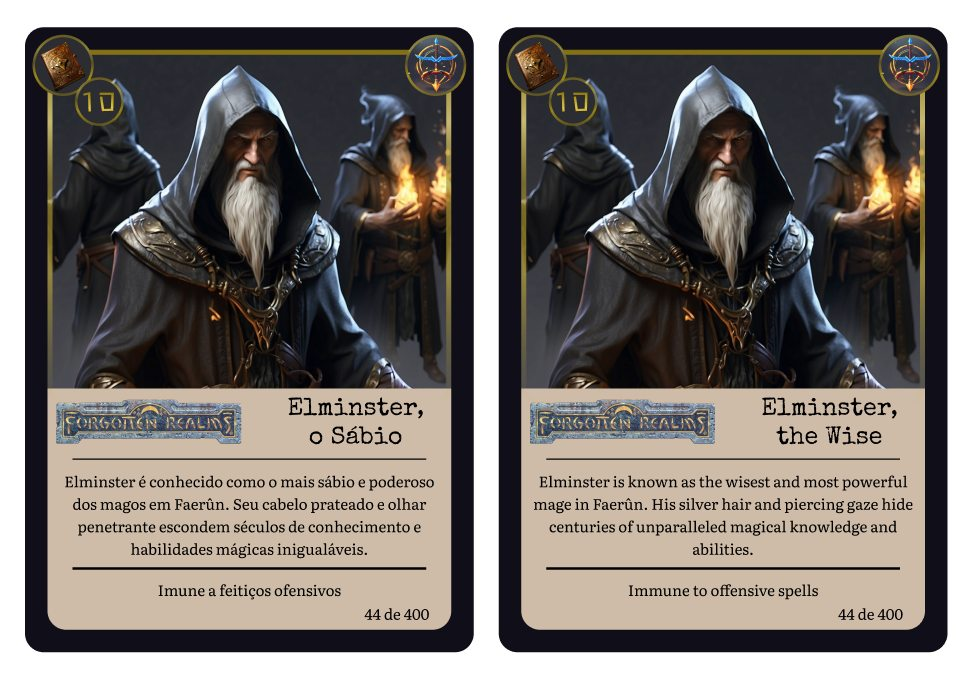

## 💻 Projeto

Card Game (Dragon Land) - 

Quando criança eu jogava muito Spellfire e D&D (Dragon Quest)... O tempo passou e perdi tudo o que tinha para amigos e primos... Estou fazendo minhas próprias cartas.
Based on D&D's renowned role-playing card game Spellfire.

Project published in vercel 💜

- [Projeto Publicado](https://dragonland.com.br)

  <a href="#-tecnologias">Tecnologias</a>&nbsp;&nbsp;&nbsp;|&nbsp;&nbsp;&nbsp;
  <a href="#-projeto">Projeto</a>&nbsp;&nbsp;&nbsp;|&nbsp;&nbsp;&nbsp;
  <a href="#-templates">Layout</a>&nbsp;&nbsp;&nbsp;|&nbsp;&nbsp;&nbsp;
  <a href="#memo-licença">Licença</a>

 

  

 

  

 

  

## 🚀 Tecnologias

Esse projeto foi desenvolvido com as seguintes tecnologias:

- [CSS](https://www.w3schools.com/css/)
- [JAVASCRIPT](https://www.javascript.com/)

## 🔖 Templates

- [CARD GAME](https://www.figma.com/file/roo4cLzRlkgWqt6Uf95eVy/Dragon-Land?type=design&node-id=0%3A1&mode=design&t=dZXj3sEHeZ8o0ML7-1)

- [WEB]()

- [MOBILE]()

## 🧠 Agradecimento

Gratidão a [Atriostech](https://atriostech.com.br/) - A tecnologia está sempre em evolução e não podemos parar de aprender!

## :memo: Licença

Esse projeto está sob a licença [MIT](https://pt.wikipedia.org/wiki/Licen%C3%A7a_MIT)

## 🏃‍♂️ Step by step do projeto
[001 - Iniciando Projeto](https://github.com/devtiagoabreu/dragonland)

## 📅 Última atualização

28/12/2023 - 09h41min

---

## 🏋️ Links úteis
- [Regras | Referências | Assets](https://drive.google.com/drive/folders/1pODtsoChbuGlFz3uphNzAdQRVK7E2oGx?usp=drive_link)

Codado com muita alegria e filhas no colo ♥ by [Tiago de Abreu](http://atriostech.com.br/tiago/) :wave: 

